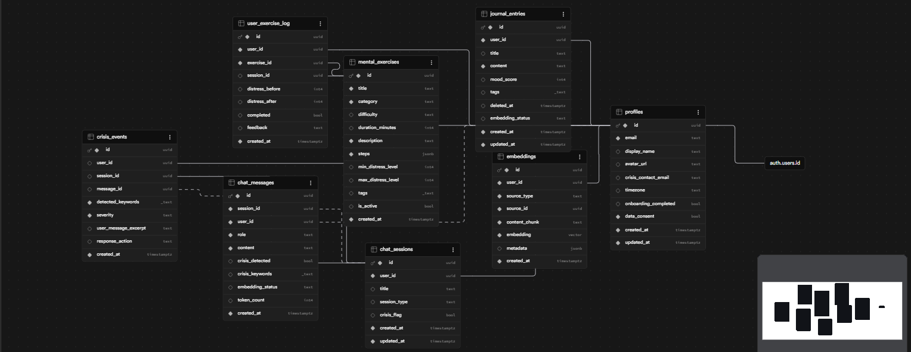

# Bloom — AI-Powered Mental Health Companion

Bloom is a full-stack mental wellness web application that provides 24/7 AI-driven emotional support, private journaling, guided therapeutic exercises, and real-time crisis detection — all in a secure, privacy-first environment.

---

## Table of Contents

- [Overview](#overview)
- [Features](#features)
- [Tech Stack](#tech-stack)
- [Architecture](#architecture)
- [Database Schema](#database-schema)
- [API Reference](#api-reference)
- [Getting Started](#getting-started)
- [Environment Variables](#environment-variables)
- [Project Structure](#project-structure)
- [Safety & Crisis System](#safety--crisis-system)
- [AI & RAG Pipeline](#ai--rag-pipeline)
- [Rate Limiting](#rate-limiting)
- [Admin Dashboard](#admin-dashboard)
- [Deployment](#deployment)
- [Security](#security)
- [Contributing](#contributing)

---

## Overview

Bloom bridges the gap between professional mental health care and everyday emotional wellness. The app uses large language models (LLMs) for empathetic conversation, vector embeddings for contextual memory, and a layered safety system for detecting and responding to crisis situations.

**Core goals:**
- Make mental health support accessible, private, and immediate
- Provide guided exercises grounded in therapeutic techniques
- Detect crisis signals early and connect users to real resources
- Give administrators observability over safety events without compromising user privacy

---

## Features

### AI Chat Companion
- Real-time streaming responses via Groq API (LLaMA 3.3 70B)
- Automatic fallback to LLaMA 3 8B on rate limits
- Conversational memory via last-10-message context window
- RAG-enhanced responses using the user's own journal entries and past chat
- Session types: `general`, `crisis`, `exercise`

### Private Journal
- Rich text entries with title, content, mood score (1–10), and tags
- Automatic semantic embedding on creation
- Soft deletion (entries are never permanently purged)
- Paginated list view (20 per page)
- Mood tracking over time

### Guided Therapeutic Exercises
- 6 categories: `breathing`, `grounding`, `cognitive_reframe`, `body_scan`, `journaling_prompt`, `distraction`
- Animated step-by-step exercise player (expand / contract / hold cues)
- Difficulty levels: easy, medium, hard
- Distress-level matching: exercises suggested based on current state (1–10 scale)
- Completion logging with before/after distress scores and feedback

### Crisis Detection & Safety
- Multi-layer detection: keyword scan + parallel LLM classification
- Three severity levels with tailored responses:
  - **Critical** — suicide/self-harm intent → immediate resources (988, Crisis Text Line 741741, 911)
  - **High** — hopelessness, entrapment → empathetic response + resources
  - **Medium** — overwhelmed, depressed → validation + exercise recommendation
- 40+ crisis keywords covering common phrasing variations
- All crisis events logged for admin monitoring
- Emergency contact field in user profile for escalation

### Admin Dashboard
- Platform-wide analytics (users, messages, journal entries, exercises, crisis events)
- 30-day daily activity bar chart
- User management with individual profile drilldown
- Crisis events log with severity and detected keywords
- Top-10 most active users (by message count, last 30 days)
- Email-based admin gating (no role column in DB — simpler, auditable)

### Authentication
- Supabase Auth with OAuth (Google/GitHub)
- SSR-compatible cookie management (`@supabase/ssr`)
- Automatic profile creation on first sign-in (DB trigger)
- Row-Level Security on all tables — users can only access their own data

---

## Tech Stack

| Layer | Technology |
|-------|-----------|
| Framework | Next.js 16.2.5 (App Router, React Server Components) |
| Language | TypeScript 5 |
| UI | React 19.2.4, Tailwind CSS 4, Shadcn/ui, Radix UI |
| Animation | Framer Motion 12.38.0 |
| Icons | Lucide React |
| Notifications | Sonner |
| Database | Supabase (PostgreSQL + pgvector + RLS) |
| Auth | Supabase Auth + `@supabase/ssr` |
| AI / LLM | Groq API — LLaMA 3.3 70B, LLaMA 3 8B |
| Embeddings | Transformers.js 2.17.2 (`all-MiniLM-L6-v2`, 384-dim) |
| Rate Limiting | Upstash Redis (sliding window) |
| Styling tools | Tailwind Merge, Class Variance Authority, CLSX |
| Compiler | Babel React Compiler plugin (auto-optimization) |
| Linting | ESLint 9 |

---

## Architecture

```
Browser (React 19 + Next.js App Router)
        │
        ▼
Next.js Server (API Routes + Server Components)
        │
   ┌────┴──────────────────────────────┐
   │                                   │
Supabase (PostgreSQL + pgvector)    Groq API
   │                                   │
   │  ┌── profiles                 LLaMA 3.3 70B (primary)
   │  ├── journal_entries          LLaMA 3 8B (fallback)
   │  ├── chat_sessions
   │  ├── chat_messages            Transformers.js
   │  ├── embeddings               (all-MiniLM-L6-v2)
   │  ├── mental_exercises         runs server-side
   │  ├── user_exercise_log
   │  └── crisis_events
   │
Upstash Redis (rate limiting)
```

### Request Flow — Chat Message

1. User sends message → `POST /api/chat/[sessionId]/messages`
2. Rate limit check (Upstash)
3. Crisis detector runs keyword scan on message
4. RAG pipeline generates embedding, queries `pgvector` for similar past content
5. System prompt assembled: base persona + crisis context (if any) + RAG results
6. Groq API called with streaming enabled
7. Response streamed to client via `ReadableStream`
8. Message + response saved to `chat_messages`
9. If crisis detected: `crisis_events` row inserted, admin notified via dashboard

---

## Database Schema



### Tables

#### `profiles`
Extends `auth.users`. Created automatically on signup via trigger.

| Column | Type | Description |
|--------|------|-------------|
| id | uuid (PK) | References `auth.users.id` |
| email | text | User email |
| display_name | text | Display name |
| avatar_url | text | Profile picture URL |
| crisis_contact_email | text | Emergency contact |
| timezone | text | User timezone |
| onboarding_completed | bool | Onboarding flow status |
| data_consent | bool | Privacy consent flag |
| created_at | timestamptz | |
| updated_at | timestamptz | |

#### `journal_entries`

| Column | Type | Description |
|--------|------|-------------|
| id | uuid (PK) | |
| user_id | uuid (FK) | References `profiles.id` |
| title | text | Entry title |
| content | text | Entry body (10k char limit) |
| mood_score | int4 | 1–10 mood scale |
| tags | _text | Array of tags |
| embedding_status | text | `pending` / `processing` / `done` / `failed` |
| deleted_at | timestamptz | Soft delete timestamp |
| created_at | timestamptz | |
| updated_at | timestamptz | |

#### `chat_sessions`

| Column | Type | Description |
|--------|------|-------------|
| id | uuid (PK) | |
| user_id | uuid (FK) | |
| title | text | Session title |
| session_type | text | `general` / `crisis` / `exercise` |
| crisis_flag | bool | Whether crisis was detected |
| created_at | timestamptz | |
| updated_at | timestamptz | |

#### `chat_messages`

| Column | Type | Description |
|--------|------|-------------|
| id | uuid (PK) | |
| session_id | uuid (FK) | |
| user_id | uuid (FK) | |
| role | text | `user` / `assistant` / `system` |
| content | text | Message content |
| crisis_detected | bool | Crisis flag |
| crisis_keywords | _text | Keywords that triggered detection |
| embedding_status | text | Embedding pipeline status |
| token_count | int4 | Token usage |
| created_at | timestamptz | |

#### `embeddings`

| Column | Type | Description |
|--------|------|-------------|
| id | uuid (PK) | |
| user_id | uuid (FK) | |
| source_type | text | `journal` / `chat` |
| source_id | uuid | Reference to source record |
| content_chunk | text | Text that was embedded |
| embedding | vector | 384-dimensional float vector |
| metadata | jsonb | Mood score, date, session type, etc. |
| created_at | timestamptz | |

#### `mental_exercises`

| Column | Type | Description |
|--------|------|-------------|
| id | uuid (PK) | |
| title | text | Exercise name |
| category | text | `breathing` / `grounding` / `cognitive_reframe` / `body_scan` / `journaling_prompt` / `distraction` |
| difficulty | text | `easy` / `medium` / `hard` |
| duration_minutes | int4 | Estimated duration |
| description | text | Overview text |
| steps | jsonb | Array of step objects (instruction, duration, animation) |
| min_distress_level | int4 | Minimum distress for recommendation |
| max_distress_level | int4 | Maximum distress for recommendation |
| tags | _text | Searchable tags |
| is_active | bool | Whether exercise is live |
| created_at | timestamptz | |

#### `user_exercise_log`

| Column | Type | Description |
|--------|------|-------------|
| id | uuid (PK) | |
| user_id | uuid (FK) | |
| exercise_id | uuid (FK) | |
| session_id | uuid (FK, nullable) | Linked chat session |
| distress_before | int4 | 1–10 score before exercise |
| distress_after | int4 | 1–10 score after exercise |
| completed | bool | Whether user finished |
| feedback | text | Optional user feedback |
| created_at | timestamptz | |

#### `crisis_events`

| Column | Type | Description |
|--------|------|-------------|
| id | uuid (PK) | |
| user_id | uuid (FK) | |
| session_id | uuid (FK) | |
| message_id | uuid (FK) | |
| detected_keywords | _text | Keywords that fired |
| severity | text | `critical` / `high` / `medium` |
| user_message_excerpt | text | Anonymized excerpt |
| response_action | text | Action taken by system |
| created_at | timestamptz | |

---

## API Reference

All routes require authentication via Supabase session cookie unless noted.

### Chat

| Method | Route | Description |
|--------|-------|-------------|
| GET | `/api/chat/sessions` | List user's chat sessions |
| POST | `/api/chat/sessions` | Create new session |
| GET | `/api/chat/[sessionId]` | Get session details |
| PATCH | `/api/chat/[sessionId]` | Update session (title, crisis_flag) |
| DELETE | `/api/chat/[sessionId]` | Delete session |
| GET | `/api/chat/[sessionId]/messages` | Get all messages in session |
| POST | `/api/chat/[sessionId]/messages` | Send message, get streamed AI response |

### Journal

| Method | Route | Description |
|--------|-------|-------------|
| GET | `/api/journal` | List entries (paginated, 20/page) |
| POST | `/api/journal` | Create new entry |
| GET | `/api/journal/[entryId]` | Get single entry |
| PATCH | `/api/journal/[entryId]` | Update entry |
| DELETE | `/api/journal/[entryId]` | Soft-delete entry |

### Exercises

| Method | Route | Description |
|--------|-------|-------------|
| GET | `/api/exercises` | List exercises (filterable by category, difficulty, distress level) |
| POST | `/api/exercises/log` | Log exercise completion |

### User

| Method | Route | Description |
|--------|-------|-------------|
| GET | `/api/user` | Get current user profile |
| PATCH | `/api/user` | Update profile fields |

### Embeddings

| Method | Route | Description |
|--------|-------|-------------|
| POST | `/api/embed` | Trigger embedding pipeline for a source |

### Admin (requires admin email)

| Method | Route | Description |
|--------|-------|-------------|
| GET | `/api/admin/users` | List all users |
| GET | `/api/admin/users/[userId]` | User detail + activity |
| GET | `/api/admin/stats` | Platform-wide analytics |
| GET | `/api/admin/crisis` | Crisis event log |

---

## Getting Started

### Prerequisites

- Node.js 18.17+
- A [Supabase](https://supabase.com) project
- A [Groq](https://console.groq.com) API key
- An [Upstash Redis](https://upstash.com) database

### Installation

```bash
git clone https://github.com/your-username/bloom.git
cd bloom
npm install
```

### Database Setup

```bash
# If using Supabase CLI
supabase login
supabase link --project-ref YOUR_PROJECT_REF
supabase db push

# Or apply migrations manually in the Supabase SQL editor
# Files are in supabase/migrations/ — run in order (001 → 007)
# Then run supabase/seed.sql to seed exercise data
```

### Configure Environment

```bash
cp .env.example .env.local
# Fill in all values (see Environment Variables section)
```

### Run Development Server

```bash
npm run dev
```

Open [http://localhost:3000](http://localhost:3000).

---

## Environment Variables

```env
# Supabase
NEXT_PUBLIC_SUPABASE_URL=https://your-project.supabase.co
NEXT_PUBLIC_SUPABASE_ANON_KEY=your_anon_key
SUPABASE_SERVICE_ROLE_KEY=your_service_role_key

# AI
GROQ_API_KEY=gsk_your_groq_key

# Rate Limiting (Upstash Redis)
UPSTASH_REDIS_REST_URL=https://your-db.upstash.io
UPSTASH_REDIS_REST_TOKEN=your_token

# App
NEXT_PUBLIC_SITE_URL=http://localhost:3000

# Admin access (comma-separated emails)
ADMIN_EMAILS=admin@example.com

# Optional: Transformers.js model cache path
TRANSFORMERS_CACHE=/tmp/transformers-cache
```

---

## Project Structure

```
bloom/
├── src/
│   ├── app/                    # Next.js App Router
│   │   ├── page.tsx            # Landing page
│   │   ├── layout.tsx          # Root layout
│   │   ├── auth/               # Login + OAuth callback
│   │   ├── dashboard/          # Protected user routes
│   │   │   ├── chat/           # Chat sessions + conversation
│   │   │   ├── journal/        # Journal CRUD
│   │   │   ├── exercises/      # Exercise library + player
│   │   │   └── settings/       # User profile settings
│   │   ├── admin/              # Admin-only routes
│   │   │   ├── users/          # User list + drilldown
│   │   │   └── crisis/         # Crisis event log
│   │   └── api/                # 14 REST API endpoints
│   │
│   ├── components/             # React components (24 files)
│   │   ├── ui/                 # Shadcn/Radix primitives
│   │   ├── layout/             # Sidebar navigation
│   │   ├── shared/             # LoadingSpinner, SafetyBanner, etc.
│   │   ├── chat/               # ChatContainer, MessageBubble, CrisisAlert
│   │   ├── exercise/           # ExercisePlayer, ExercisesClient
│   │   ├── journal/            # Journal components
│   │   ├── dashboard/          # Dashboard widgets
│   │   └── admin/              # AdminSidebar, StatCard, MiniBarChart
│   │
│   ├── lib/
│   │   ├── ai/                 # Groq client, embeddings, RAG, prompts
│   │   ├── supabase/           # Client, server, service role clients
│   │   ├── safety/             # Crisis detector, keyword lists, filters
│   │   └── rate-limit/         # Upstash rate limiters
│   │
│   ├── hooks/
│   │   └── useChat.ts          # Chat state hook
│   │
│   └── types/                  # TypeScript types (database, safety)
│
├── supabase/
│   ├── migrations/             # 7 SQL migration files
│   └── seed.sql                # Exercise seed data
│
├── public/                     # Static assets
├── next.config.ts              # Next.js config (React Compiler enabled)
├── tailwind.config.ts
├── tsconfig.json
└── components.json             # Shadcn/ui config
```

---

## Safety & Crisis System

Bloom's crisis system is multi-layered to balance sensitivity and specificity:

### Layer 1 — Keyword Detection (`lib/safety/crisis-keywords.ts`)

Runs synchronously on every incoming message. Categorizes matches into three severity buckets:

- **Critical:** direct self-harm/suicide language (e.g., "kill myself", "want to die", "suicidal")
- **High:** hopelessness, entrapment (e.g., "no way out", "can't go on", "trapped")
- **Medium:** distress, overwhelm (e.g., "depressed", "can't cope", "breaking down")

### Layer 2 — LLM Classification (`lib/safety/crisis-detector.ts`)

Runs in parallel with keyword detection using a lightweight model. Provides:
- Semantic understanding of ambiguous phrases
- Context-aware severity scoring
- Final severity merged with keyword result (takes highest)

### Layer 3 — Response Injection (`lib/ai/prompts.ts`)

If crisis detected, system prompt is dynamically extended:
- Empathy-first response framing
- Crisis-level-appropriate resource injection
- For **critical**: 988 Suicide & Crisis Lifeline, Crisis Text Line (741741), 911
- For **high/medium**: encouragement to seek support, exercise suggestions

### Layer 4 — Event Logging

All crisis events written to `crisis_events` table with:
- Severity level
- Detected keywords
- Anonymized message excerpt
- Response action taken

Admins can monitor all events in real time via `/admin/crisis`.

---

## AI & RAG Pipeline

### Embedding Generation

```
New journal entry or chat message
         │
         ▼
POST /api/embed
         │
         ▼
Transformers.js (all-MiniLM-L6-v2)
  → 384-dimensional vector
         │
         ▼
INSERT INTO embeddings (user_id, source_type, source_id, content_chunk, embedding, metadata)
```

### RAG Retrieval (at chat time)

```
User message
     │
     ▼
Generate query embedding (all-MiniLM-L6-v2)
     │
     ▼
pgvector similarity search
  → Top 6 chunks, similarity >= 0.72
  → Filtered to current user's data only
     │
     ▼
Inject as context into system prompt
  "From your past conversations/journals: ..."
     │
     ▼
Groq LLM generates contextual response
```

This gives the AI "memory" of what the user has shared in the past without storing everything in the prompt window.

---

## Rate Limiting

| Endpoint | Limit | Window |
|----------|-------|--------|
| Chat messages | 20 requests | 1 minute (sliding) |
| Journal creation | 10 requests | 1 minute (sliding) |
| Global | 100 requests | 1 hour (sliding) |

Limits are enforced per-user using Upstash Redis sliding window algorithm. Exceeding a limit returns HTTP 429 with retry-after header.

---

## Admin Dashboard

Accessible at `/admin` — restricted to emails listed in `ADMIN_EMAILS`.

**Analytics cards:**
- Total registered users + 7-day growth
- Total messages sent + weekly count
- Total journal entries
- Exercise completions
- Crisis events by severity (critical / high / medium)

**Charts:**
- 30-day daily message volume (bar chart)

**Tables:**
- All users with last-active timestamp
- Top 10 users by message volume (last 30 days)
- Recent crisis events with keywords and severity

**User drilldown (`/admin/users/[userId]`):**
- Full profile details
- Message history summary
- Journal entry count
- Exercise completion history
- Crisis events involving this user

---

## Deployment

### Vercel (recommended)

1. Push repo to GitHub
2. Import project in Vercel
3. Add all environment variables from the list above
4. Deploy — Vercel handles the Next.js build automatically

**Notes for Vercel:**
- Transformers.js models are cached in `/tmp` (serverless function temp storage)
- Set `TRANSFORMERS_CACHE=/tmp/transformers-cache` in Vercel env vars
- Ensure Supabase project is on a paid plan if expecting > 500 concurrent connections
- Functions that run embeddings may need their timeout increased (default 10s → 60s)

### Other Platforms

The app is a standard Next.js application and can be deployed anywhere that supports Node.js 18.17+:

```bash
npm run build
npm start
```

---

## Security

| Area | Approach |
|------|---------|
| Data isolation | Supabase RLS — every query is scoped to `auth.uid()` |
| Auth | Supabase Auth + httpOnly cookies via `@supabase/ssr` |
| Admin access | Environment variable email list, checked server-side |
| Rate limiting | Per-user sliding window via Upstash Redis |
| Input validation | Zod-style checks at API boundaries |
| Crisis data | Stored minimally; excerpts only, never full messages |
| Transport | TLS enforced by Supabase and Vercel |
| Secrets | Never exposed to client — `SUPABASE_SERVICE_ROLE_KEY` and `GROQ_API_KEY` are server-only |

**No sensitive health data is sold or shared.** The `data_consent` field in profiles records explicit user consent.

---

## Available Scripts

```bash
npm run dev      # Start development server with HMR
npm run build    # Production build (React Compiler enabled)
npm start        # Run production server
npm run lint     # Run ESLint
```

---

## Contributing

1. Fork the repository
2. Create a feature branch: `git checkout -b feature/your-feature`
3. Follow existing code patterns — check `src/lib/` and `src/components/` for conventions
4. Ensure no RLS policies are broken by new queries
5. Test crisis detection changes carefully — err on the side of over-detecting
6. Open a pull request with a clear description of changes

---

## Crisis Resources

If you or someone you know is in crisis:

- **988 Suicide & Crisis Lifeline** — Call or text **988** (US)
- **Crisis Text Line** — Text **HOME** to **741741**
- **International Association for Suicide Prevention** — https://www.iasp.info/resources/Crisis_Centres/
- **Emergency Services** — **911** (US) or your local emergency number

---

## License

MIT — see [LICENSE](./LICENSE) for details.
